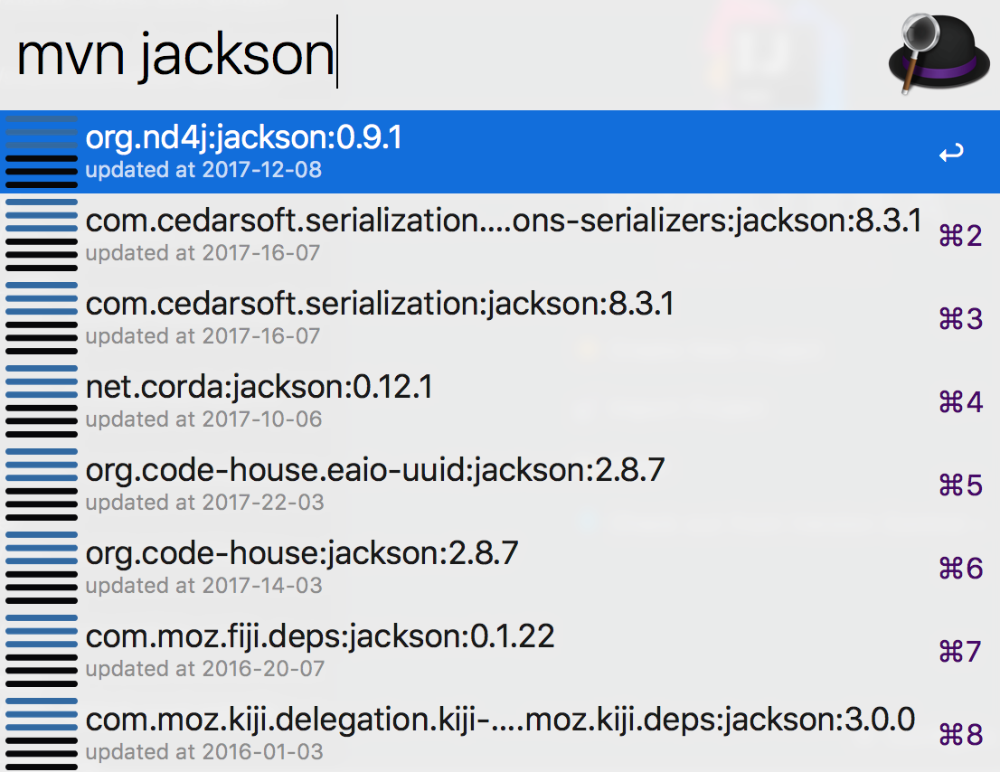

# alfred-mvns
[](https://nodei.co/npm/alfred-mvns/)

## Install

```
$ npm install -g alfred-mvns
```

*Requires [Node.js](https://nodejs.org) 4+ and the Alfred [Powerpack](https://www.alfredapp.com/powerpack/).*


## Usage

In Alfred, type `mvn`, and your query, to search for java libraries at maven central repository.

Select a item and press <kbd>enter</kbd> to copy `maven dependency` to clipboard.<br>

Hold <kbd>alt</kbd> and press <kbd>enter</kbd> to copy `gradle dependency` to clipboard.<br>

## Demo



press <kbd>enter</kbd> get:

```
<dependency>
  <groupId>org.nd4j</groupId>
  <artifactId>jackson</artifactId>
  <version>0.9.1</version>
</dependency>
```
Hold <kbd>alt</kbd> and press <kbd>enter</kbd> get:

```
compile 'org.nd4j:jackson:0.9.1'
```

## Related

- [alfy](https://github.com/sindresorhus/alfy) - Create Alfred workflows with ease


## License

MIT © 
